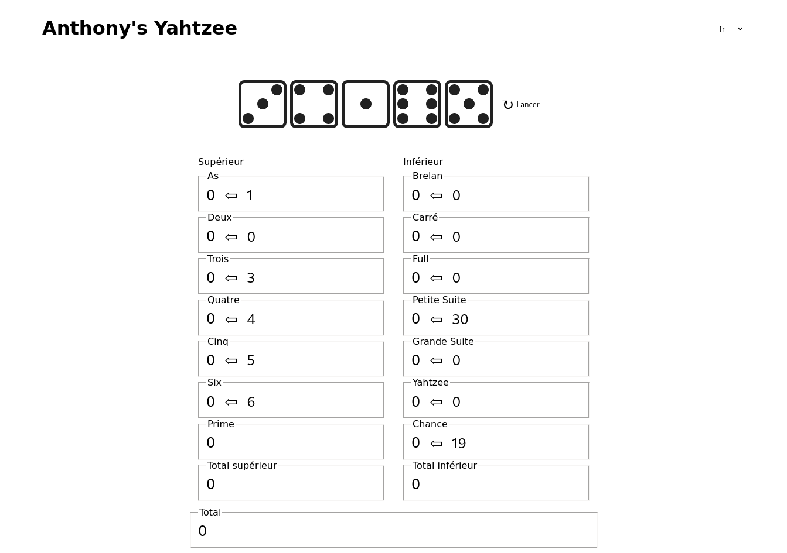

# Yahtzee

Simple Yahtzee apps with multiple front technologies.

These apps exists only to try some web technologies and keep an eye on these technologies.

I used no images and no external styling tool/framework. Only CSS.

See live version [here](https://kuroidoruido.github.io/yahtzee).

## Yahtzee Toolkit

The Yahtzee Toolkit is a basic headless yahtzee implementation built with Redux Toolkit with no other dependencies to theorically fit with any frontend web technologies to build app.

## Current implementations

- Lit + Redux (with Yahtzee Toolkit)

## Exprected App

